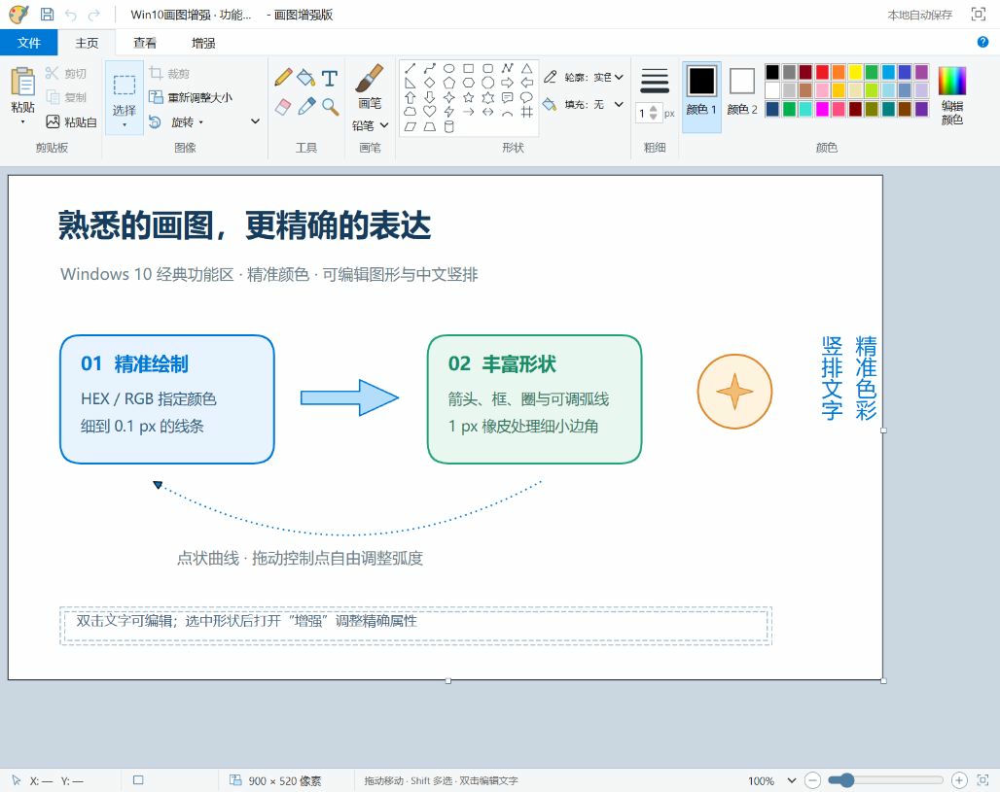

# 画图增强版 · Paint 10 Plus

本项目采用独立源码，重现 Windows 10 经典画图的标题栏、快速访问栏、文件菜单、主页／查看功能区、颜色 1／颜色 2、白色画板和底部缩放操作。在这一基础上增加精准色彩、丰富形状、可调曲线、精细橡皮和中文竖排文字。

它是可在本机离线运行的绘图应用。图片采用位图图层，形状和文字采用可编辑矢量对象；不是微软发行的画图程序，也未使用微软程序的反编译代码。

## 打开

双击 **启动画图软件.cmd**，或用现代浏览器打开 **index.html**。首次打开是 **900 × 520 像素的空白画板**；以后会恢复当前浏览器的自动保存。无需安装绘图依赖，也不需要网络。

推荐在本地服务模式使用图片剪贴板等浏览器功能：安装 Node.js 18 或更新版本，在本文件夹运行 `npm start`，然后打开 <http://127.0.0.1:4173>。服务仅监听本机；终端按 `Ctrl+C` 关闭。端口可通过 `PORT` 环境变量调整。

## 经典画图操作

- 文件菜单：新建空白画布、打开图片、打开工程、保存工程和导出图片。
- 剪贴板：剪切、复制、粘贴选中内容，以及从文件粘贴图片。浏览器允许访问时，可粘贴系统剪贴板中的图片。
- 图像：选择、裁剪、按像素或百分比调整大小、保持纵横比、旋转和水平／垂直翻转。
- 工具：铅笔、画笔、荧光笔、颜色填充、文字、橡皮、吸管和放大镜。
- 形状：直线、曲线、圆、矩形、圆角矩形、多边形、三角形、多种星形、四方向粗箭头、心形、闪电和标注等。
- 颜色：颜色 1、颜色 2、经典色板、无填充或实色填充，以及描边和粗细设置。
- 查看：标尺、网格、状态栏、缩放和画布平移。

可打开 PNG、JPEG、WebP、BMP 和 GIF 图片；GIF 使用第一帧。导入后统一转换为内嵌 PNG，工程文件可完整携带图片，无需保留原文件位置。

选择工具可以点击矢量对象移动；拖出矩形选区后，可以在区域内部拖动来移动所选像素，也可复制、剪切或裁剪。粘贴的图片成为新图层，可以拖动和调整尺寸。

功能区中的 **裁剪、重新调整大小、旋转／翻转和油漆桶填充**，以及 **移动、剪切或清除像素选区**，会把当前可见画布合成为图片，再执行像素处理。完成后原来的形状和文字合并为一个图片图层；**撤销**可以恢复操作前的可编辑对象。功能区旋转针对整个画布；只想旋转某个对象时，在增强属性面板设置该对象的旋转角度，或拖动其旋转控制柄。

## 增强功能

- HEX／RGB 数值输入和吸管取色，避免只靠色板近似选择。
- 原有四方向粗箭头之外，支持可编辑线箭头、双向箭头和端点样式。
- 实线、虚线、点状线条、空心框和圈；选中曲线后拖动控制点调整弧度。
- 最小 1 像素橡皮，放大后可擦除细小边角；保留对象的其余部分。
- 横排和中文竖排文字，字体、字号、粗体、行距和对齐设置。
- 增强属性面板：精确位置、宽高、旋转和透明度，以及对象排列、可见性和锁定。
- 撤销／重做、本地自动保存、可再次打开的工程文件，以及 PNG 和 SVG 导出。

打开“增强”属性面板可调整选中对象的精确数值。双击文字可以重新编辑；绘制直线或几何形状时按住 `Shift` 可约束角度或比例。

“多边形／折线”工具采用逐点单击：至少指定三个点后，点击起点可闭合为可填充多边形；按 `Enter` 或双击则结束为开放折线。

## 保存与导出

**保存工程**下载 `.graphite` 文件，保留形状、文字、图片、样式及擦除记录。工程格式继续兼容之前的 `graphite-studio` 第 1 版工程；旧版自动保存示例不会被自动加载为空白画板。

自动保存位于当前浏览器中，不会跨浏览器或跨打开方式同步。浏览器存储空间有限，含有较大图片的作品应下载工程文件；存储失败时界面会提示。

PNG 支持倍率和透明背景，最大支持 6400 万像素。SVG 保留矢量形状和内嵌图片，适合后续编辑；图片图层仍受原始像素分辨率限制。文字依赖当前电脑可用的字体，导出不会内嵌字体文件。

画布尺寸支持 **1～12000 像素**；工程最多 **2000 个对象、250000 个坐标点和 20 MB 文件总量**，内嵌图片计入总量。工程图片仅允许内嵌 PNG、JPEG 或 WebP；不接受外部图片链接或 SVG 图片源。作品内容保留在本机，软件不会上传作品。

## 快捷键

| 快捷键 | 操作 |
| --- | --- |
| `Ctrl+Z`／`Ctrl+Shift+Z` 或 `Ctrl+Y` | 撤销／重做 |
| `Ctrl+S` | 保存可编辑工程 |
| `Ctrl+N`／`Ctrl+O` | 新建空白画布／打开图片 |
| `Ctrl+A`／`Ctrl+D` | 全选／复制选中对象 |
| `Ctrl+X`／`Ctrl+C`／`Ctrl+V` | 剪切／复制／粘贴 |
| `Delete` 或 `Backspace` | 删除选中的未锁定对象 |
| 方向键／`Shift+方向键` | 移动 1 px／10 px |
| `V`、`H`、`B`、`L`、`C` | 选择、平移、铅笔、直线、曲线 |
| `R`、`O`、`T`、`E`、`I`、`P` | 矩形、椭圆、文字、橡皮、吸管、折线 |
| `F`／`Z` | 油漆桶填充／放大镜 |
| 按住空格拖动／滚轮 | 平移画布／缩放 |
| `+`／`-`／`0` | 放大／缩小／适应画布 |
| `Shift` 绘制或旋转 | 约束比例、45° 线条或 15° 旋转 |
| `Enter`／`Esc` | 完成折线／取消当前绘制 |

输入框和弹窗中的快捷键以文字输入为优先；文字弹窗可用 `Ctrl+Enter` 确认。

## 源码与验证

所有源码采用 UTF-8。运行无需第三方包；`npm start` 使用 Node.js 内置本地服务。

运行 `npm test` 检查对象旋转、局部擦除、形状命中、曲率控制、横竖文字、SVG 输出、工程图片安全与往返、数据边界和像素填充。`npm run check` 检查各模块语法。

浏览器已验证封闭矩形的油漆桶填充不会泄漏到外部，并且可撤销；真实 PNG 可以按 2400 × 1600 像素打开、保持比例缩至 600 × 400，再旋转为 400 × 600。系统图片剪贴板需要浏览器支持并允许访问，也可通过“粘贴自”导入本地图片。

本次还验证了图片区域复制／粘贴／裁剪／移动、画布拖柄、HEX 与 RGB 同步、中文竖排编辑、曲线控制点、多边形闭合、右键颜色 2、1 px 局部擦除，以及含内嵌图片的工程保存和 2× PNG 导出。自动检查共 421 项通过，所有源码均通过 UTF-8 校验。

文件菜单“打开工程”可打开 `examples/增强功能示例.graphite`，其中的形状和文字均可编辑。最终界面截图保存在 `docs/preview.svg`。

GitHub Actions 会在 Windows 和 Linux 上使用 Node.js 24 自动运行语法检查和测试，不需要安装第三方依赖。

## 许可证

版权所有 © 2026 N2N14。

本项目以 **GNU Affero General Public License 第 3 版（AGPL-3.0-only）** 发布，完整条款见 [LICENSE](LICENSE)。公开源码位于 [N2N14/paint10-plus](https://github.com/N2N14/paint10-plus)，问题和改进建议可提交到 [GitHub Issues](https://github.com/N2N14/paint10-plus/issues)。
